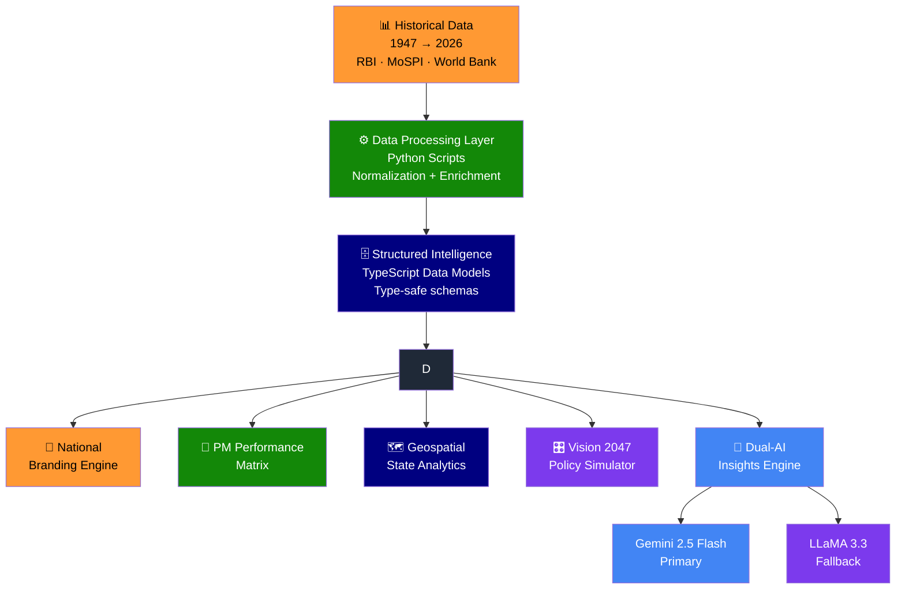

<div align="center">


<br/>


<br/><br/>


&nbsp;

&nbsp;

&nbsp;

&nbsp;

&nbsp;


<br/><br/>


</div>

<br/>

---

<div align="center">

## 🇮🇳 What is India Matrix?

</div>

```
India in numbers:

  → 78 years of independence
  → 15 Prime Ministers · 18 leadership tenures
  → 28 states · 8 union territories
  → $3.9 trillion economy (2026)
  → Chandrayaan · Mangalyaan · UPI · Aadhaar

All of it — tracked, visualized, and AI-analyzed in one platform.
```

<div align="center">

### ⚡ India Matrix is the most comprehensive open intelligence platform built on India's national data.

</div>

<br/>

---

<div align="center">

## 🧠 Platform Architecture


</div>



<br/>

---

<div align="center">

## ✨ Six Intelligence Modules

</div>

<table>
<tr>
<td align="center" width="33%">
<br/>
<b>🦁 National Branding Engine</b><br/>
Metallic Ashoka Lions insignia, adaptive dark/light theme, fully responsive from 320px to 4K.
</td>
<td align="center" width="33%">
<br/>
<b>👥 PM Performance Matrix</b><br/>
15 Prime Ministers. 18 tenures. GDP, inflation, policies, space achievements, conflicts — head-to-head radar comparison.
</td>
<td align="center" width="33%">
<br/>
<b>🗺️ Geospatial State Engine</b><br/>
Interactive Leaflet maps — ISRO spaceports, steel mills, tech parks, Golden Quadrilateral, bullet train corridors.
</td>
</tr>
<tr>
<td align="center" width="33%">
<br/>
<b>🤖 Dual-AI Insights</b><br/>
Gemini 2.5 Flash + LLaMA 3.3 analyze national policy with a witty take on Indian bureaucracy and governance.
</td>
<td align="center" width="33%">
<br/>
<b>🎲 Growth Matrix Quiz</b><br/>
Test your knowledge on space missions, reforms, and achievements. Earn ranks like <i>Swaraj Samrat</i>. Share on X/LinkedIn.
</td>
<td align="center" width="33%">
<br/>
<b>🎛️ Vision 2047 Simulator</b><br/>
Adjust policy budget sliders — infrastructure, energy, health, education — and see India's centenary GDP projections in real time.
</td>
</tr>
</table>

<br/>

---

<div align="center">

## 🛠️ Tech Stack


</div>

<br/>

<div align="center">

| Layer | Technology | Details |
|:---:|:---:|:---|
| 🖥️ **Frontend** | React + TypeScript (92.7%) | Strict typing, component-driven, heavily type-checked |
| 🗺️ **Maps** | Leaflet.js | Interactive geospatial overlays across all 36 states/UTs |
| 🤖 **AI Primary** | Google Gemini 2.5 Flash | Policy analysis, national data Q&A |
| 🔄 **AI Fallback** | Meta LLaMA 3.3 | Auto-switches if Gemini unavailable |
| 🐍 **Data Scripts** | Python (2.2%) | Historical data processing + normalization |
| 🎨 **Styling** | CSS Custom Properties (3.9%) | Adaptive dark/light, tri-color inspired palette |
| 📊 **Data Sources** | RBI · MoSPI · World Bank · ISRO | Official government + international registries |

</div>

<br/>

---

<div align="center">

## 📊 By The Numbers

</div>

<div align="center">

| Stat | Value |
|:---:|:---:|
| 🗓️ **Data Range** | 1947 → 2026 |
| 👥 **Prime Ministers Tracked** | 15 PMs · 18 Tenures |
| 🗺️ **States & UTs Mapped** | 36 |
| 📈 **Economic Indicators** | GDP · Inflation · HDI · Per Capita |
| 🚀 **Achievement Categories** | Space · Nuclear · Defense · Infrastructure |
| 🤖 **AI Models** | 2 (Gemini + LLaMA) |
| 💻 **Primary Language** | TypeScript 92.7% |

</div>

<br/>

---

<div align="center">

## 🗺️ Roadmap

</div>

```
████████████████████████████████████████████████████  COMPLETE ✅

  ✅ PM Performance Matrix — 15 PMs, 18 tenures, 18+ metrics
  ✅ Head-to-head PM comparison with radar charts
  ✅ Interactive Leaflet geospatial state maps
  ✅ State deep-dive — Per Capita, HDI, industries, projects
  ✅ Dual-AI insights — Gemini 2.5 Flash + LLaMA 3.3 fallback
  ✅ Vision 2047 Policy Simulator with shareable URL export
  ✅ Growth Matrix Quiz with shareable rank cards
  ✅ Ashoka Lions insignia with adaptive dark/light theme
  ✅ Fully responsive — 320px to 4K

░░░░░░░░░░░░░░░░░░░░░░░░░░░░░░░░░░░░░░░░░░░░░░░░░░░  COMING 🚧

  ○ District-level drill-down maps
  ○ Election results overlay (1952 → 2024)
  ○ Budget allocation visualizer (year-by-year)
  ○ Real-time economic data via API
  ○ Comparative India vs BRICS nations module
```

<br/>

---

<div align="center">


<br/>

**[🇮🇳 Live Demo](#)** &nbsp;·&nbsp; **[🐛 Report Bug](https://github.com/26Utkarsh/India-Matrix/issues)** &nbsp;·&nbsp; **[💡 Request Feature](https://github.com/26Utkarsh/India-Matrix/issues)**

<br/>

Built by [**26Utkarsh**](https://github.com/26Utkarsh)


</div>
